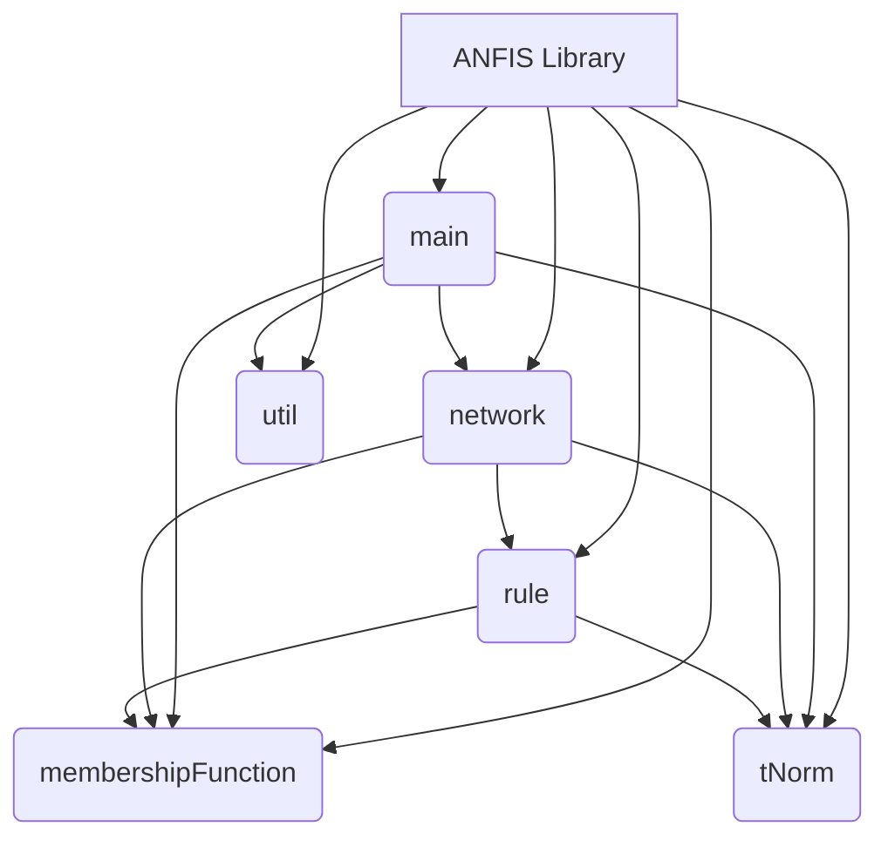
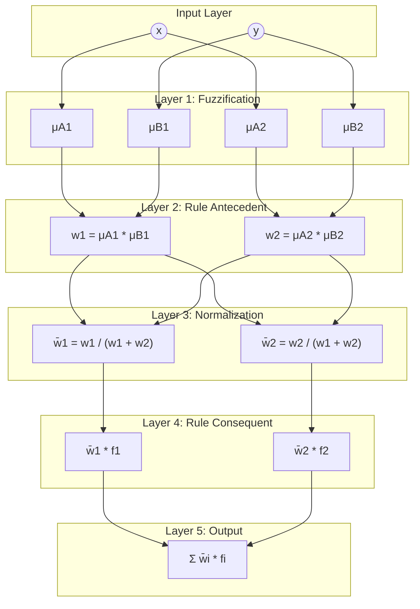

# Generic ANFIS Implementation in Java

This project provides a generic and extensible Java implementation of an Adaptive Neuro-Fuzzy Inference System (ANFIS). The implementation is designed to be easily configurable with different membership functions and T-norms, making it a flexible tool for building and training ANFIS models.


## What is ANFIS?

An Adaptive Neuro-Fuzzy Inference System (ANFIS) is a type of artificial neural network that is based on a Takagi-Sugeno fuzzy inference system. It integrates both neural networks and fuzzy logic principles, which allows it to capture the benefits of both in a single framework.

The basic idea behind ANFIS is to use a neural network's learning capabilities to tune the parameters of a fuzzy inference system. This results in a system that can learn from data like a neural network, but is also interpretable like a fuzzy logic system.

An ANFIS network typically has five layers:

1.  **Fuzzification Layer:** This layer takes the crisp input values and determines the degree to which they belong to each of the fuzzy sets. This is done using membership functions.
2.  **Rule Layer:** This layer calculates the firing strength (or weight) of each fuzzy rule. The firing strength is typically calculated by applying a T-norm operator (like the product or minimum) to the membership values from the fuzzification layer.
3.  **Normalization Layer:** This layer normalizes the firing strengths of the rules by dividing each firing strength by the sum of all firing strengths.
4.  **Defuzzification Layer:** This layer calculates the output of each rule based on the conclusion part of the rule (which is a linear function of the inputs in a Takagi-Sugeno system) and the normalized firing strength.
5.  **Output Layer:** This layer sums the outputs of all rules to produce the final output of the ANFIS network.

## Architecture

### Project Structure



### ANFIS Network Architecture



## Project Overview

This project provides a Java implementation of an ANFIS that is designed to be:

*   **Modern Java:** The project is built with Java 21 and leverages modern features like records, sealed classes, streams, and immutability to create a more robust and maintainable codebase.
*   **Generic and Extensible:** The implementation is not tied to any specific membership function or T-norm. You can easily plug in your own implementations by implementing the `IMembershipFunction` and `ITNorm` interfaces.
*   **Configurable:** The ANFIS network's parameters (number of rules, learning rate, etc.) can be easily configured through a `config.properties` file.
*   **Well-Documented:** The code is documented with Javadoc comments, and this README provides a comprehensive overview of the project.

## Documentation

For more detailed documentation, please see the following guides:

*   [Getting Started](./docs/GettingStarted.md)
*   [Advanced Usage](./docs/AdvancedUsage.md)

## Implementation Details

The core components of the implementation are:

*   **`IMembershipFunction` and `ITNorm`:** These are `sealed` interfaces that define the contracts for membership functions and T-norms, respectively. This allows for a controlled and extensible design.
*   **Immutable Records:** The core components of the network, including `ANFIS`, `Rule`, `Conclusion`, `Pair`, and `SigmoidMF`, are implemented as immutable `records`. This makes the code more robust and easier to reason about.
*   **Functional Learning Algorithms:** The `OfflineGradientDescent` and `OnlineGradientDescent` classes are designed to work with the immutable `ANFIS` record. They take an `ANFIS` instance and a dataset, and return a new `ANFIS` instance with the updated parameters.
*   **Configuration:** The `Main` class loads the network configuration from a `config.properties` file, making it easy to experiment with different parameters.
*   **CLI Monitoring:** The `Main` class provides a simple CLI that shows the learning progress in real-time.

## How to Run

This project is built with Maven. You can compile, test, and run the application using Maven commands.

### Compile the code

To compile the code, run the following command from the root of the project:

```bash
mvn compile
```

### Run the example

To run the example `Main` class, you can use the `exec-maven-plugin`:

```bash
mvn exec:java -Dexec.mainClass="hr.fer.zemris.nenr.lab2.main.Main"
```

### Build the executable JAR

To build an executable JAR file, run the following command:

```bash
mvn package
```

This will create a file named `anfis-1.0.0.jar` in the `target` directory.

### Run from the JAR

You can run the application from the JAR file using the following command:

```bash
java -jar target/anfis-1.0.0.jar
```
